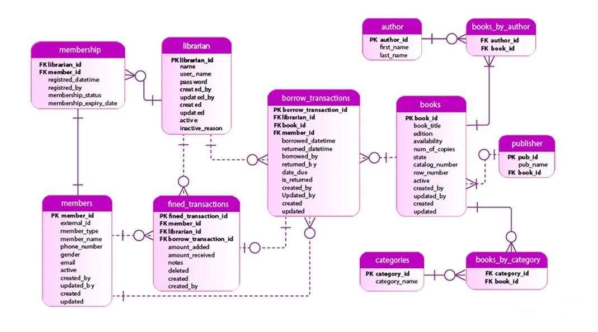

# Library-Management-System
# 1.	Introduction
Library database system is designed to maintain the library assets in a suitable way. This report is about a relational database design of a school library in which members of the library can  keep track on availability of books, information about membership either they are student or staff of school, they can join or leave library and some responsibilities of librarians are added.
The core goals of this report are to define the entities, attributes and their relationship to create a database that can be easily managed by admin. Following are the facilities:
Librarian: can find if the book is available or not its status and how much fine is due
Member: can borrow & return books and can leave and join library
In the report the findings describe the deficiency of data keeping method and, which can be increase the budget to hire manpower. Following these findings, conclusions are drawn and a number of recommendations are made as to how to increase the reliability of data, reduce redundancy and accessibility to data has been made stress-free.

# 2.	Objectives
The objectives of this report are to provide a database management system for school library which will help to minimize the duplication of data, get rid from paper filling system and it makes the processing of data very easy without waste of time.

# 3.	Tools and Techniques
Existing system of the library is manual system which has lack of functionalities. As due to large volume of books and daily based queries system is not comfortable to handle daily transaction properly.
It’s a right time to rebuild the library system because as day by day number of students and staff are increasing in our institute and size of library is also expanding so we need workforce to handle it that’s why there should be a seamless process which can handle all this pressure in proper way. At that point our teacher suggested the creation of relational database system which can manage all these problems
Requirement Analysis
Our library database system provides cost effective and efficient procedure to maintain data of library. It needs to store student details because it’s an internal library of college so we don’t need to store any customer’s data. We store staff detail, librarian details and available resources i.e. books, journals, cds, racks etc. detail in our database.
Students need to register in library to get membership which has limit of one year so at time of registration he needs to provide his name, course name, id, DOB and address. A library card can be issued to him after storing details in system. 
Books has unique number for their identity and category type, author name,  publisher name, copy number etc. and library must have record of which book is issued to which member of library and either its return on time or not and calculation of fine overdue.
When a student borrows a book an entry of his name is entered in database by librarian and return date is automatically comes up in system. It also shows how many books are issued to one member. They can only borrowed maximum of five books at a time. Before borrowing any book members of library can check if the book is available or not.
Tasks of librarians are following:
* Add members
* Add library cards and assign them to members
* Handle returns
* Check fines
* Add books/ assets to the database
* Remove assets from the database
* Receive payments from members and update the fines
* View all member’s detail
This report examines that any educational system can use it in their libraries to determine about the author detail, publisher’s detail, availability of books, can track members record etc. and it is very easy to modify by making changes in database. It does not examine online system of library
 Technology Used
* HeidiSQL 9.5
* Xampp
* Lucidchart
* MS Excel 2010
* MS Word 2010

# 4.	Features 
* Detail of each student/member is stored in database
* Large number of volume of books are easily maintained 
* List of students with same category can be viewed 
* List of available books can be viewed
* Fine is easily calculated by system automatically
* Librarians can add/modify/delete students and books 
* Can see the list of issued books
* List of books not returned on time by entering their id or name of book 
* Borrowing of book become easy because in database librarian can find in seconds if this is book is issued to someone else or not
* Librarians has password and login detail of database so it is secure process

# 5.	E-R diagram
“E-R Diagram or Entity-relationship model is a graphical representation of entities and their relationships to each other, typically used in computing in regard to the organization of data within databases” 
It is cleared from above discussion that main entities of Library are, members (student or staff), books and librarians which store data regarding any queries e.g. how many books are borrowed, fine payable etc. In this diagram we try to show possible entities and their relationship with each other and what attributes they hold. Using ER Design redundancy of many items can be reduced and it’s a good practice to show relation among entities.

# Cardinality of the relationship/Multiplicity is described as:
* An Author can write many books (1:*)
* A book can have many authors (1:*)
* A book can have many categories (1:*)
* A member can be associated with zero or many books borrowed (0:*)
* A borrowed transaction must only be associated with one and only one member (1:1)
* Books can have zero or many transactions…… (0: *)
* Librarian handle transactions…….. (1 :*)
* Librarian creates membership……. (1 :*)
* Librarian perform fine transaction… (1 :*)
* Borrow transactions on fines… (1:0)
* Members pays fine… ……………… (1:*)
* Members can have only one membership ……….. (1:1) 
* Identifying relationship is when child object is dependent on parent object.
* Shown as dotted line:               - - - - - - - - - 
* Non-identifying relationship is when the primary key attributes of the parent must not become primary key attributes of the child defined as continuous line:                

In this diagram we can see that entity borrow_transaction is dependent on librarian, books and members entities because for every transaction these three requirements are necessary. A librarian can issue books, Librarian provides membership and done transactions on books and can also get fine from members. Because many transactions can be done on many books at same time we associate books with transactions. In this EERD we can see the clear many to many relations of books and author and similarly for books and categories entity. This diagram show dependencies of relation and reduce redundancy problems as well.

# 6.	Limitations
Though computerized library systems are widely used because this is the world of technology and development so people preferred to use computer based systems rather than manual it has some limitations too. These limitations can be happen not only in these library management systems but also in any kind of software based system too.
* Risk of hardware or software failure  
* Data can be crashed
* Training required to understand the system
* It required high conversion cost to transform file-based system into computer based system

# 7.	 Conclusion
The main conclusion that can be drawn is therefore that using MySQL database system has been designed for school library which can be used to store data regarding books, members of library and can also update, delete and add new records. 
This database is designed with that flexibility that it can be implemented in any library in future; it can be modified easily into new technology. We can add as many data as required.

